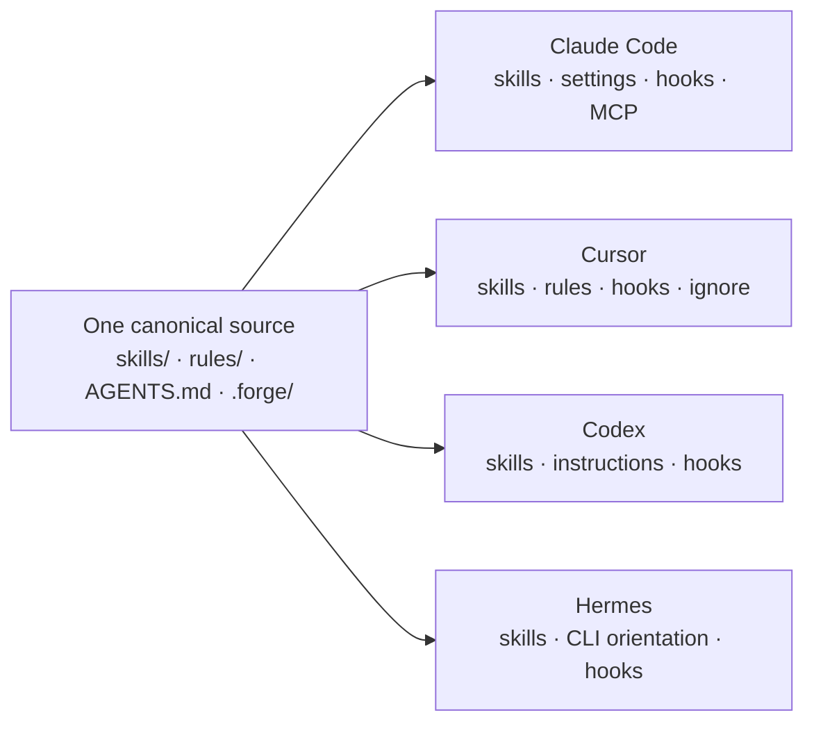
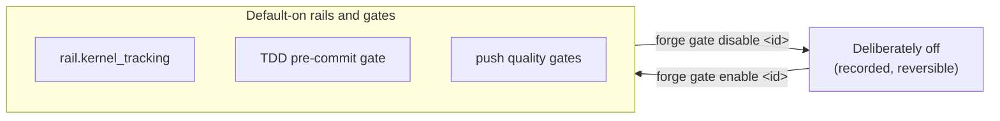

# Forge

[](https://www.npmjs.com/package/forge-workflow)
[](https://github.com/harshanandak/forge/blob/master/LICENSE)
[](https://github.com/harshanandak/forge/actions/workflows/test.yml)
[](https://github.com/harshanandak/forge/actions/workflows/eslint.yml)
[](https://github.com/harshanandak/forge)
[](https://github.com/harshanandak/forge/actions/workflows/size-check.yml)
[](https://github.com/harshanandak/forge/actions/workflows/codeql.yml)
[](https://github.com/harshanandak/forge/blob/master/SECURITY.md)

## Never lose the thread of AI-assisted work.

Coding agents are fast — and forgetful. Sessions break. Context resets. The
agent forgets what it was doing, issues pile up untracked, and three months
later you can't reconstruct why a change was made or what's still unfinished.
Every new agent needs its own setup, and none of them share what the last one
knew.

**Forge fixes that.** It's an agent-agnostic control plane that gives your
coding agent — and you — a shared, durable memory of the work: issues,
dependencies, workflow state, decisions, and validation evidence, all kept in
your repo. Hand work to any agent, walk away mid-task, come back on another
machine, and pick up exactly where you left off.

```bash
npx forge setup     # install for your agent (Claude Code, Codex, Cursor, Hermes)
npx forge init      # configure your workflow gates + change classification
npx forge status    # one-glance: where you are, what's next, what's ready
```

**[See what's coming next → ROADMAP.md](ROADMAP.md)**

## Why Forge

### 🤝 Works with your agent — whichever it is

Claude Code, OpenAI Codex, Cursor, and Hermes today. You maintain **one
canonical source** — skills, rules, instructions, hook policy, safety
defaults — and Forge renders it into each agent's **native format**. Switch
agents, mix agents, onboard a teammate on a different agent: everyone gets the
same workflow, and nobody rewrites config.



No lock-in, no per-agent reinvention — and no silent drift, because the
rendered files are generated and drift-checked, never hand-copied.

### 🛡️ Enforcement that actually enforces

Most "workflow" tooling is just prompts and hope. Forge wires its TDD gate and
protected-path policy into **native hooks on all four agents**, so the rules
hold even when the agent forgets them:

- **Claude Code & Cursor** — project-local hooks installed automatically at
  setup: test-first gating plus protected-path denial (on Cursor, shell writes
  to protected paths are blocked too).
- **Codex & Hermes** — those agents read hooks from global config, so Forge
  never touches it silently: one explicit, consent-guarded command
  (`forge hooks install --global`, with `--dry-run` preview) merges Forge's
  hooks in without clobbering anything you already have.

Git hooks remain the always-on backstop underneath, for any agent — or any
human.

### 🧾 Nothing discussed goes missing

Every idea, bug, decision, and follow-up raised in a session gets filed to the
local issue kernel **immediately** — that's a default-on rail, rendered into
every agent's rules. Three weeks later, "that thing we noticed but didn't fix"
is a tracked, searchable issue instead of a lost chat message.

Like every Forge rail, it's yours to control:
`forge gate disable rail.kernel_tracking` turns it off deliberately.

### 🧵 Break anywhere, continue anywhere

Your project state lives in the repo, not in a chat window. Workflow stage,
claimed work, issues, memory, and handoff context survive session resets,
context compaction, and machine switches. Any agent reads the same source of
truth through `forge status`, `forge prime`, and `forge orient` — so a session
that dies at 2am resumes cleanly the next morning, on any device, with any
agent.

### 🧹 A lifecycle that cleans up after itself

Merged a PR with squash-merge? `forge clean` still knows the worktree is done —
it detects merges through three tiers (direct ancestry, squash-merge tree
matching, and merged-PR head refs) instead of leaving "active" ghosts around.
After merges, your local master is fast-forwarded automatically so the next
piece of work starts from reality, not from last week.

### 🔒 Safety by default

`forge setup` ships safe defaults for each agent's native safety surface: a
sane tool-permission allowlist for Claude Code (secrets denied, dev commands
allowed) and a `.cursorignore` secrets boundary for Cursor. Everything is
merge-preserving — your existing config is respected — and everything can be
opted out of.

### 🔎 Never lose track — down to the smallest thing

Forge ships a local issue **kernel** plus a project **memory** system. Capture
work the moment you spot it, wire up real dependencies, and everything stays
tracked: what's ready, what's blocked, what's stale, what's done. Searchable and
recoverable — find work from *months* ago in seconds instead of digging through
old branches and chat logs.

```bash
forge create --title "Fix flaky auth test" --type bug
forge issue dep add <blocker-id> <blocked-id>   # model real dependencies
forge ready                                     # what can I pick up right now?
forge remember "auth uses rotating JWT — see lib/auth.js"   # write memory
forge recall auth                               # read it back, later, anywhere
```

### 📋 Honest by construction

Forge keeps a machine-readable capability matrix of exactly what is delivered
on each agent — and its statuses come from a closed, test-enforced vocabulary,
so a claim can't quietly outrun the code. What's not delivered yet says
"not delivered", in the repo, verifiably. See
[the full per-agent capability reference](docs/reference/AGENT_SKILL_PARITY.md).

## Ready now vs. experimental

**Ready now** — installed and on by default:

| Capability | What you get |
| --- | --- |
| Multi-agent rendering | One canonical source → native skills, rules, instructions for Claude Code, Cursor, Codex, Hermes |
| Native enforcement hooks | TDD gate + protected-path denial on Claude Code and Cursor at setup; opt-in global install for Codex and Hermes |
| Kernel tracking rail | Everything discussed becomes a tracked issue, default-on, toggleable |
| Issue kernel | Create, claim, depend, close — local, fast, searchable |
| Project memory | `forge remember` / `forge recall`, file-backed local store |
| Lifecycle hygiene | Squash-merge-aware `forge clean`, automatic master fast-forward |
| Safety defaults | Claude permission allowlist + Cursor secrets ignore, merge-preserving |
| Quality-gated pushes | `forge push`: branch protection + lint + tests before anything leaves your machine |

**Experimental / opt-in** — real, shipped, and clearly labeled:

| Capability | How to opt in |
| --- | --- |
| Knowledge-graph memory (Graphiti) | `memory.backend: graphiti` in `.forge/config.yaml` — temporal, relational recall ([guide](docs/guides/memory-backends.md)) |
| Global hooks for Codex/Hermes | `forge hooks install --global` (consent-guarded, `--dry-run` first) |
| Conditional auto-merge | `forge merge --auto <pr>` — off by default, merges only when configured rules pass |
| Verified issue writes | Check-after-write read-back on kernel mutations (`gate.issue_verify`) — landing now; it caught a real projection bug on its first run. See [ROADMAP.md](ROADMAP.md) |

## A workflow you own

Forge installs a proven **TDD-first** workflow —
`/plan → /dev → /validate → /ship → /review` by default, with `/verify` added in
the profiles that need it — but it is *not* a fixed prompt pack. Every stage and
quality gate is a toggle, not a YAML archaeology project:



The default makes you productive on day one; the controls are yours from day
two. Change your change-classification, adapt the stages to how your team
actually works, and update it as you grow.

## Who it's for

- **Solo builders** using AI agents who are tired of lost handoffs and
  half-remembered context.
- **Teams** coordinating multiple agent or developer sessions in one repo.
- **Quality-conscious engineers** who want agent output they can review, trust,
  and release — grounded in local evidence, not vibes.
- **Maintainers** keeping agent-authored work safe enough to resume and ship.

## Quickstart

```bash
# Add to your project
bun add -D forge-workflow          # or: npm install --save-dev forge-workflow

# Install for your agent(s) and configure the workflow
bunx forge setup --agents claude --yes
bunx forge init --profile minimal --classification standard --yes

# Orient — for you and your agent
bunx forge status                  # human one-glance view
bunx forge prime                   # session-entry orientation for agents
```

<details>
<summary><strong>Per-agent setup notes</strong></summary>

- **Claude Code** — `forge setup --agents claude` installs skills under
  `.claude/skills/`, a `CLAUDE.md` shim over `AGENTS.md`, native enforcement
  hooks and safe permission defaults in `.claude/settings.json`, and MCP config.
- **Cursor** — `forge setup --agents cursor` installs `.cursor/skills/`,
  policy rules in `.cursor/rules/`, native hooks in `.cursor/hooks.json`, a
  `.cursorignore` secrets boundary, and MCP config.
- **Codex** — `forge setup --agents codex` stages skills for the global Codex
  install and commits a repo-local skills mirror so teammates get discovery on
  clone. Hooks are global-config only: run `forge hooks install --global
  --harness codex` when you want them.
- **Hermes** — Forge-owned skills are projected under `.hermes/skills/` and
  consumed through `forge orient` / `forge recap`. Hooks:
  `forge hooks install --global --harness hermes`.

The full, honest per-agent delivery status lives in the
[capability matrix reference](docs/reference/AGENT_SKILL_PARITY.md).

</details>

Full guides:

- [Quickstart](QUICKSTART.md) — clean first run, step by step
- [Setup guide](docs/guides/SETUP.md)
- [Support and troubleshooting](docs/guides/SUPPORT.md)
- [Command reference](docs/reference/COMMANDS.md)
- [Workflow templates & customization](docs/guides/WORKFLOW_TEMPLATES.md)

Use `forge init` for the `.forge/` runtime config (gates + classification). Use
`forge setup` to install agent instructions, skills, and agent-specific files.
Use `bunx forge ...` (or `npx forge ...`) until the `forge` bin is on your PATH.

### Setup flags

| Flag | Use |
| --- | --- |
| `--agents claude,cursor` | Install for specific agents (or `--all` for every harness). |
| `--quick` | Use sensible defaults with minimal prompts. |
| `--yes` / `--non-interactive` | Run without prompts; `CI=true` also enables non-interactive behavior. |
| `--dry-run` | Preview planned writes without touching the repo. |
| `--symlink` | Link instruction files instead of copying, where supported. |
| `--merge smart\|preserve\|replace` | Choose how setup handles existing instruction files. |
| `--sync` | Deprecated. Removes old generated Beads/GitHub sync files; future issue sync belongs to Kernel/server authority. |

## What you get

- **Issue kernel** — `forge create`, `forge ready`, `forge show`, `forge claim`,
  `forge close`, `forge issue dep`, `forge blocked`, `forge stale`. The Kernel is
  the default backend; a Beads store can be imported (below) or selected as an
  opt-out backend with `--issue-backend beads`.
- **Project memory** — `forge remember` / `forge recall` for durable, searchable
  notes that outlive the session (no scattered `MEMORY.md` files), with an
  opt-in knowledge-graph backend for temporal recall
  ([memory guide](docs/guides/memory-backends.md)).
- **One-glance state** — `forge status`, `forge board`, `forge orient`,
  `forge prime`, `forge recap` for humans and agents.
- **Safe, isolated work** — `forge worktree create <slug>`, squash-merge-aware
  `forge clean`.
- **Configurable quality gates** — `forge validate`, `forge push` (branch
  protection + lint + tests), tuned per project via `forge gate` and
  `forge init`.
- **Native agent enforcement** — TDD + protected-path hooks rendered for all
  four agents; project-local and automatic where the agent allows it, one
  consent-guarded command where it doesn't.
- **Ship & recover** — `forge ship`, `forge review`, `forge shepherd` (bounded PR
  monitor), `forge merge` (opt-in conditional auto-merge, off by default),
  `forge upgrade` (safe self-heal).
- **Coming from Beads?** `forge migrate --from beads` imports your existing issue
  store into the Kernel in one command (`--dry-run` to preview first); the first
  kernel use also auto-imports a detected store, so nothing is lost.

## Common commands

```bash
forge --help
forge status                 # where am I, what's next
forge ready                  # available work
forge show <issue-id>
forge claim <issue-id>
forge remember "<note>"      # write project memory
forge recall <query>         # read it back
forge worktree create <slug>
forge board --json
forge validate
forge gate disable <gate-id> # every rail and gate is yours to toggle
```

Stage commands such as `/plan`, `/dev`, `/review`, and `/verify` are agent
workflow stages installed by `forge setup`. Pre-merge is a documentation-and-
handoff gate embedded in `/ship` and `/review`, not a separate stage.

## Documentation map

- [Roadmap](ROADMAP.md) — what's shipping next, by theme
- [Docs index](docs/INDEX.md) — canonical reading order
- [Migration guide](docs/guides/MIGRATION.md) — moving to the Kernel and current workflow framing
- [Workflow templates & customization](docs/guides/WORKFLOW_TEMPLATES.md) — the default workflow and how to change it
- [Skills and command projections](docs/reference/SKILLS.md)
- [Agent capability matrix](docs/reference/AGENT_SKILL_PARITY.md) — honest per-agent delivery status
- [Memory backends](docs/guides/memory-backends.md) — local default and the opt-in graph backend
- [Adapters](docs/reference/ADAPTERS.md) — review adapter contract
- [Protected state surfaces](docs/reference/protected-state-surfaces.md)
- [Release reference](docs/reference/RELEASE.md)

## Terms

- **Control plane** — local commands, files, and checks that give agents a shared operating surface.
- **Kernel** — the default local issue-state store, backing `forge` issue commands.
- **Workflow template** — the default stage path Forge installs (`/plan → /dev → /validate → /ship → /review`, with `/verify` in the profiles that need it), fully configurable.
- **Harness** — an agent-specific instruction surface. Forge supports Claude Code, Codex, Cursor, and Hermes.
- **Rail** — a default-on behavior policy (like kernel tracking) rendered into every agent's rules and toggleable with `forge gate`.
- **Memory** — durable, searchable project notes written with `forge remember` and read with `forge recall`.
- **Adapter** — an integration boundary for review or issue tools.
- **Protected state** — files that should be changed through their owning command or API, not by casual edits.

## Package

Package name: `forge-workflow`

Binary names: `forge`, `forge-workflow`, `forge-preflight`

## License

MIT
