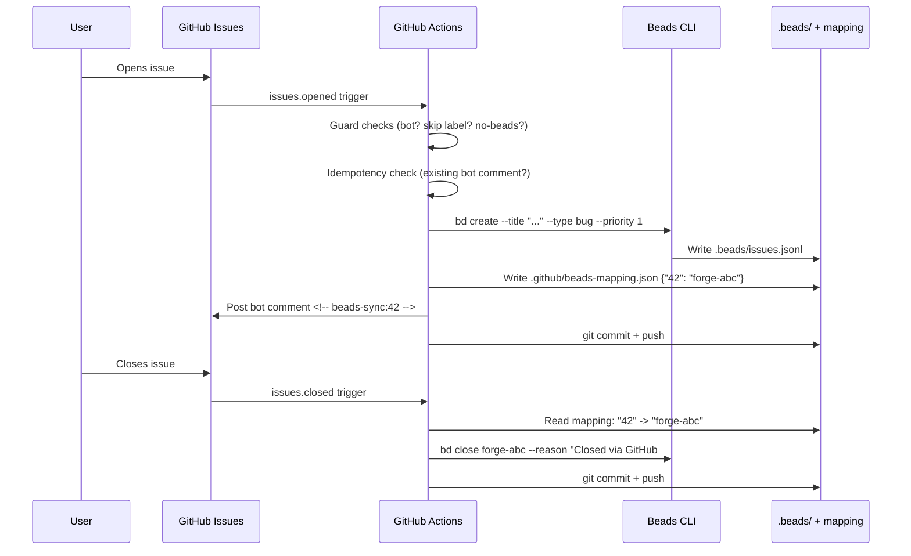
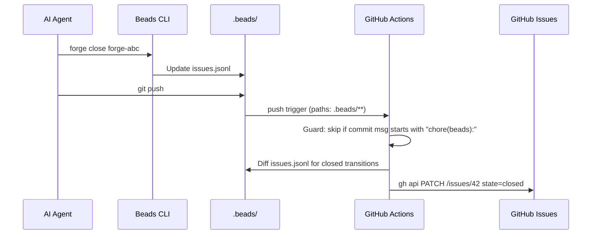

# GitHub <-> Beads Issue Sync

Automatic synchronization between GitHub Issues and Beads issue tracking.

**GitHub Issues** = human/team/public interface.
**Beads** = issue engine behind Forge (`forge ready`, `forge close`).

Neither side needs to know about the other. Contributors file issues on GitHub; AI agents pick up work via Beads. Status changes propagate automatically.

For human and agent workflows, prefer the Forge wrapper commands (`forge ready`,
`forge create`, `forge close`, `forge sync`). The workflow automation shown below
still calls `bd` directly as an internal implementation detail.

---

## Architecture

### Phase 1: GitHub -> Beads (CI-driven)



### Phase 2: Beads -> GitHub (push-triggered)



### Loop Prevention

Three guards prevent infinite ping-pong:

1. **Bot detection** -- workflows skip events from `github-actions[bot]`
2. **Commit message prefix** -- Phase 2 workflow skips commits starting with `chore(beads):`
3. **Opt-out label** -- `skip-beads-sync` label on any issue disables sync entirely

---

## Setup

### Via Forge Setup (recommended)

```bash
bunx forge setup
# During interactive prompts:
# "Enable GitHub <-> Beads sync? (y/n)" -> y
```

This scaffolds:
- `.github/workflows/github-to-beads.yml`
- `.github/workflows/beads-to-github.yml` (Phase 2)
- `.github/beads-mapping.json`
- `scripts/github-beads-sync/` (Node modules)
- `scripts/github-beads-sync.config.json`

### Manual Setup

1. Copy workflow files from `templates/` into `.github/workflows/`
2. Copy `scripts/github-beads-sync/` and `scripts/github-beads-sync.config.json`
3. Create `.github/beads-mapping.json` with `{}`
4. Ensure Beads is initialized: `bd init`
5. Commit and push to enable the workflows

---

## Configuration Reference

All settings live in `scripts/github-beads-sync.config.json`.

### Label and Type Mapping

| Field | Type | Default | Description |
|-------|------|---------|-------------|
| `labelToType` | `object` | `{"bug":"bug", "enhancement":"feature", "documentation":"task", "question":"task"}` | Maps GitHub labels to Beads issue types. First matching label wins. |
| `labelToPriority` | `object` | `{"P0":0, "critical":0, "P1":1, "high":1, "P2":2, "medium":2, "P3":3, "low":3, "P4":4, "backlog":4}` | Maps GitHub labels to Beads priority levels (0-4). First matching label wins. |
| `defaultType` | `string` | `"task"` | Beads type when no label matches `labelToType`. |
| `defaultPriority` | `number` | `2` | Beads priority when no label matches `labelToPriority`. |
| `mapAssignee` | `boolean` | `true` | Whether to copy GitHub assignee to Beads issue on creation. |

### Security Gates (Public Repos)

| Field | Type | Default | Description |
|-------|------|---------|-------------|
| `publicRepoGate` | `string` | `"none"` | Access control for public repos. See [Security](#security) section. |
| `gateLabelName` | `string` | `"beads-track"` | Required label when `publicRepoGate` is `"label"`. |
| `gateAssociations` | `string[]` | `["MEMBER", "COLLABORATOR", "OWNER"]` | Allowed author associations when `publicRepoGate` is `"author_association"`. |

### Example: Custom Configuration

```json
{
  "labelToType": {
    "bug": "bug",
    "feature": "feature",
    "chore": "chore",
    "spike": "task"
  },
  "labelToPriority": {
    "urgent": 0,
    "important": 1,
    "normal": 2,
    "nice-to-have": 3
  },
  "defaultType": "task",
  "defaultPriority": 2,
  "mapAssignee": true,
  "publicRepoGate": "author_association",
  "gateAssociations": ["MEMBER", "COLLABORATOR", "OWNER"]
}
```

---

## Security

### Public Repo Gate

On public repos, anyone can open an issue -- which triggers a commit to your default branch via the sync workflow. The `publicRepoGate` setting controls who can trigger sync:

| Value | Behavior | Recommended For |
|-------|----------|-----------------|
| `"none"` | All issues sync (default). | Private repos, trusted teams. |
| `"author_association"` | Only issues from authors in `gateAssociations` sync. | Public repos with known contributors. |
| `"label"` | Only issues with the `gateLabelName` label sync. A maintainer must add the label. | Public repos accepting external issues. |

### Input Sanitization

- Issue titles and bodies are **never interpolated in shell commands**. The sync scripts use Node `execFile` with array arguments (no shell).
- Workflow files pass event data via `env:` blocks, never via `${{ }}` in `run:` blocks (prevents GitHub Actions injection).
- Only title, URL, mapped type, and priority are stored in Beads -- raw issue body is not committed.

### SHA-Pinned Actions

All third-party actions in the workflow files are pinned to full commit SHAs, not tags. This prevents supply-chain attacks via tag mutation.

```yaml
# Good: SHA-pinned
- uses: actions/checkout@b4ffde65f46336ab88eb53be808477a3936bae11  # v4.1.1

# Bad: tag-only (never used)
- uses: actions/checkout@v4
```

---

## Opt-Out

Two ways to prevent an issue from syncing:

1. **Label**: Add `skip-beads-sync` to the GitHub issue. The workflow checks labels before processing.
2. **Body keyword**: Include `no-beads` anywhere in the issue body. Useful for quick one-off exclusions.

Both are checked at the `issues.opened` trigger. If added after creation, they prevent close-sync but not the already-created Beads issue.

---

## Troubleshooting

### Sync not triggering

- **Check workflow is enabled**: Go to Actions tab in GitHub, verify `github-to-beads` workflow exists and is active.
- **Check branch**: Workflows must exist on the default branch (usually `main` or `master`).
- **Check permissions**: The workflow needs `contents: write` and `issues: write` permissions.

### Duplicate Beads issues

- The workflow checks for an existing `<!-- beads-sync:N -->` bot comment before creating. If the comment was deleted, a duplicate may be created.
- Fix: Check `.github/beads-mapping.json` for the existing mapping and manually remove the duplicate Beads issue with `bd delete`.

### Loop detection firing incorrectly

- If legitimate commits starting with `chore(beads):` are being skipped by the Phase 2 workflow, rename the commit prefix in the workflow file.
- The bot-actor check uses `github.actor` -- ensure your CI bot user matches the expected name.

### Mapping file conflicts

- If two issues are created simultaneously, the `git push` for the second may fail due to a stale mapping file.
- The workflow retries with `git pull --rebase` up to 3 times. If it still fails, the workflow run will show as failed -- re-run it manually.

### `bd` command not found in CI

- The workflow installs Beads fresh each run: `bun add -g @beads/bd`.
- If this fails, check that the workflow uses a runner with Node/Bun available.

---

## Fork Behavior

Sync does **not** work in forks. The `GITHUB_TOKEN` provided to forked repo workflows is scoped to the fork and cannot write to the upstream repo's `.beads/` directory or post comments on upstream issues.

When a fork PR uses `Closes #N`, GitHub closes the issue on the **upstream** repo on merge. This triggers the upstream's `issues.closed` workflow, which handles the Beads close normally.

---

## GitHub Projects Integration

This plugin creates well-labeled GitHub issues but does **not** manage GitHub Projects boards. Use GitHub's built-in automation instead:

### Setting Up Auto-Add to Project

1. Go to your GitHub Project (Projects tab on your profile or org)
2. Click the `...` menu, then **Workflows**
3. Enable **"Auto-add to project"**
4. Set the filter, for example: `is:issue is:open label:bug,enhancement`
5. All matching issues (including those created by the sync) will auto-appear on your board

### Recommended Project Views

- **Board view**: Columns for `Open`, `In Progress`, `Done` -- map to Beads statuses
- **Table view**: Add `Labels`, `Assignees`, `Priority` fields for triage
- **Filter by label**: Use the labels mapped in your config to create focused views

This approach is more flexible than automating board placement -- you control the filters and views entirely within GitHub's UI.

---

## Related Documentation

- [Design doc](plans/2026-03-21-github-beads-sync-design.md) -- full design decisions, OWASP analysis, and edge cases
- [Toolchain reference](TOOLCHAIN.md) -- Beads CLI commands, installation, and troubleshooting
