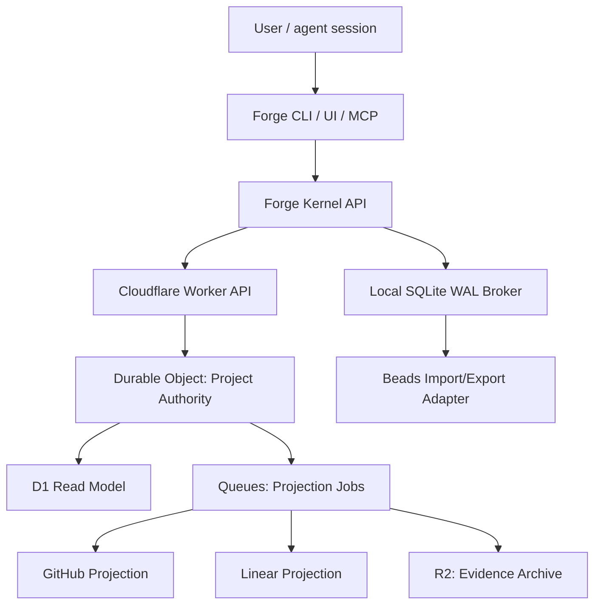

# Forge Kernel Authority Control Plane

**Date**: 2026-05-29
**Status**: Canonical plan reset proposal
**Scope**: Replace Beads/Dolt as Forge's issue authority with a Forge-native kernel, local SQLite broker, and optional Cloudflare team authority while preserving Beads as an import/export adapter.

## Decision

Forge is internal-only today. Backward compatibility with Beads is not a product requirement. Beads remains useful as a migration source and optional projection, but it is no longer the runtime authority in the target architecture.

The new authority model is:

```text
Forge CLI / UI / MCP / harness hooks
  -> Forge Kernel API
  -> Local SQLite WAL broker for solo multi-worktree coordination
  -> optional Cloudflare team authority for multi-user mode
  -> Beads / GitHub / Linear projections
```

This supersedes the Beads-first framing in D21, D22, D23, D30, D31, D36, and the post-0.0.18 release train wherever they say Beads remains the only shipped implementation, Beads is the durable source, or cloud authority is deferred on principle.

## Product Principle

Forge is not an issue tracker clone and not an agent. Forge is the governed runtime layer for agentic software delivery:

- workflow assembly controls how work runs,
- issue authority controls what work exists and who owns it,
- evaluators prove work quality,
- projections make external tools useful without making them canonical.

The workflow assembly decision remains valid, but it must sit on top of a Forge-owned issue kernel instead of a Beads-owned issue graph.

## Canonical Architecture



### Local Mode

Local mode supports one user with many worktrees and sessions. It does not require the cloud server.

The local broker is keyed by Git common-dir, not by a single worktree path. It owns:

- issue graph,
- dependencies,
- priorities,
- comments,
- claims,
- stages and substages,
- sessions,
- worktrees,
- runs,
- event log,
- local outbox,
- Beads import/export status.

SQLite WAL is the local store because it supports concurrent readers and writers on one machine. It is not used as the cross-machine team authority.

### Team Mode

Team mode requires the server. There is no offline team authority.

Cloudflare maps cleanly to the target system:

- Worker API: auth, routing, dashboard/API endpoints.
- Durable Object per project/repo: serialized claims and issue mutations.
- D1: queryable read model for dashboard and reporting.
- Queues: retryable GitHub/Linear/Beads projection jobs and dead letters.
- R2: large evidence, validation artifacts, archived session bundles.

Durable Objects are the coordination primitive. They avoid a custom distributed lock service by giving each project a single serialized authority object.

## Forge Kernel Data Model

Forge Kernel owns the normalized contracts and state. It does not hardcode every provider implementation.

Kernel-owned modules:

- `IssueGraph`: issues, statuses, priorities, comments, dependencies, parent/child links, supersession.
- `WorkflowGraph`: user-configured stages, substages, modes, gates, and evaluator bindings.
- `StageGraph`: active Stage Capability Graph resolved from workflow config and provider capabilities.
- `ProviderRegistry`: discovered skills, MCPs, agents, commands, hooks, scripts, docs/context packs, and extension manifests.
- `RunLedger`: stage/substage runs, provider runs, outcomes, evidence references, and gate results.
- `ClaimLeaseStore`: local/server claim state, stale/reclaimable/released transitions, and ownership.
- `EvidenceStore`: references to logs, artifacts, evaluator reports, and R2/local archive objects.
- `ProjectionState`: Beads/GitHub/Linear export/import state, provider delivery ids, dead letters, and repair status.
- `MigrationState`: Beads import checkpoints, validation reports, rollback notes, and unresolved import issues.
- `BlockerDependencyGraph`: blockers, prerequisites, release dependencies, issue dependencies, and implementation readiness gates.

External implementations stay outside the Kernel:

- Superpowers, BMAD, Context Mode, Spec Kit, project scripts, and MCP servers are providers.
- Claude, Cursor, Codex, and future agents are harness adapters.
- GitHub and Linear are server-side projections.
- Beads is import/export compatibility.
- Cloudflare is the team authority backend.

Minimum kernel tables/entities:

- `issues`: identity, title, status, type, priority, source, current revision.
- `issue_edges`: dependency, parent/child, supersedes, related.
- `comments`: typed comments, author, source, projection ids.
- `claims`: active/expired/released claim records.
- `stages`: workflow stage/substage state per issue.
- `sessions`: agent/user sessions.
- `worktrees`: path, branch, git common-dir, owner, active issue.
- `runs`: plan/dev/validate/ship/review/premerge/verify or custom stage runs.
- `events`: append-only source of truth.
- `projections`: Beads/GitHub/Linear delivery state.
- `dead_letters`: failed projections or rejected external writes.

Every event carries:

```yaml
event_id: uuid
idempotency_key: string
project_id: string
entity_type: issue | claim | comment | stage | run | projection
entity_id: string
actor_id: string
session_id: string
worktree_id: string
expected_revision: number
server_sequence: number
entity_revision: number
origin: forge_cli | forge_ui | mcp | hook | server_projection | import
created_at: timestamp
payload_schema_version: number
```

## Claims And Freshness

Claims are leases, not assignee labels.

Claim writes require:

- no active claim, or
- active claim is stale/reclaimable, or
- claimant owns the current claim.

Freshness is change-driven, not heartbeat-driven. Meaningful events refresh activity:

- issue update,
- comment add,
- stage start/complete,
- validation start/complete,
- PR open/update,
- session pause/resume/close,
- run phase change.

Silent long-running work emits lifecycle events only:

- `run.started`,
- `run.phase_changed`,
- `run.completed`,
- `run.failed`.

Staleness states:

- `active`: recent meaningful activity.
- `stale`: no activity past project policy threshold.
- `reclaimable`: hard stale or explicit abandon/crash.
- `released`: owner finished or intentionally released.

Reclaim always creates an audit event.

## Field Authority

Forge-owned fields:

- issue id,
- dependencies,
- execution priority,
- workflow stage/substage,
- claim lease,
- worktree/session/run state,
- evaluator evidence,
- conflict state,
- projection bookkeeping.

Provider-owned fields:

- provider-native metadata that Forge imports but does not govern.

GitHub/Linear-owned fields only when configured:

- public title/status/labels/assignee/milestone fields selected by mapping.

Beads-owned fields:

- none in the target runtime.

Beads can receive projected state, but it cannot override Forge Kernel state.

## Conflict Policy

Conflicts are resolved before projection, not inside Beads.

Rules:

1. Stale `expected_revision` rejects or quarantines the event.
2. Duplicate idempotency keys return the original accepted result.
3. Unknown external fields are rejected.
4. External webhook echoes are ignored by `origin_event_id` and provider delivery id.
5. Projection failure does not roll back Forge authority.
6. Beads export failures mark `beads_projection=failed`; Forge remains correct.
7. Manual resolution writes a first-class `conflict.resolved` event.

## Beads Strategy

Beads is a migration and compatibility adapter:

- import current issues, comments, dependencies, statuses, priorities,
- export a best-effort local Beads view if needed,
- never act as the runtime authority,
- never block Forge Kernel features if Beads cannot represent a field.

Do not fork Beads as product core. Extract useful concepts:

- issue graph,
- ready queue,
- dependencies,
- comments,
- local-first ergonomics.

Replace:

- Dolt as authority,
- direct `.beads/issues.jsonl` reads,
- Beads command wrappers as canonical writes,
- Beads sync as team coordination.

## Beads Feature Parity And Intentional Cuts

Forge Kernel must preserve the user-facing Beads behaviors Forge currently depends on, while intentionally dropping Beads/Dolt internals that are not needed for the new authority model.

### Must Preserve In Forge Kernel

| Beads behavior today | Forge Kernel replacement | Notes |
| --- | --- | --- |
| `forge create` / `bd create` | `IssueGraph.create` event | Preserves title, body, type, labels/tags, priority, parent links, source metadata. |
| `forge show` / `bd show` | `IssueGraph.read` | Must return human and JSON views with source, revision, claim, stage, projection health. |
| `forge list` / `bd list` | `IssueGraph.list` | Supports filters by status, type, label, priority, owner, stage, stale state, projection state. |
| `forge ready` / `bd ready` | `IssueGraph.ready` | Dependency-aware ready queue; excludes blocked, claimed-by-other, stale-conflict, and policy-disabled issues. |
| `forge update --priority` | `IssueGraph.reorder` / `issue.updated` | Priority changes are events; ordering must be deterministic and auditable. |
| `forge claim` / `bd update --claim` | `ClaimLeaseStore.claim` | Claim is a lease with owner, session, worktree, revision, freshness, stale/reclaim states. |
| `forge close` / `bd close` | `IssueGraph.close` | Close records resolution, actor, run/stage evidence, projection status. |
| `bd comments add` | `comments.added` | Comments are typed events with projection ids and optional evidence links. |
| `bd dep/link/dep-rm` | `IssueGraph.edge.add/remove` | Dependencies, parent/child, supersedes, related links are typed edges. |
| status/board ready/active/blocked/stale views | Kernel board/read model | Must not read `.beads/issues.jsonl`; every card shows freshness and source revision. |
| `bd sync` local/team sharing | Local outbox + server authority | Local mode stays local; team mode syncs only through Forge Server. |
| `bd audit record` concept | Kernel event log + audit subset | Keep tamper-evident critical events; raw logs/evidence are opt-in or archived. |
| `bd remember/recall` concept | Typed memory/projection records | Memory stays typed and provenance-backed, not a generic issue authority. |
| `bd preflight/doctor` concept | `forge kernel doctor` / stage preflight | Health checks validate Kernel store, migrations, projections, and protected paths. |

### Intentionally Drop Or Defer

| Beads/Dolt capability | Decision |
| --- | --- |
| Dolt branch history | Drop for Kernel MVP. Git branch/worktree context is stored in `worktrees`, `sessions`, and `runs`; issue authority is event/revision based. |
| Dolt three-way merge metadata | Replace with expected revision, idempotency key, and conflict quarantine. |
| Dolt federation/cross-machine sync | Replace with Cloudflare team authority. |
| Beads as direct runtime command dependency | Drop after import path lands. Commands route through Forge Kernel. |
| Direct `.beads/issues.jsonl` status reads | Drop. Kernel read model becomes the board/status source. |
| Beads compaction semantics | Defer. Kernel can add event compaction after import, lease, and projection correctness land. |

## Local Versus Server Storage Matrix

The system must be clear about what is stored offline and what is pushed to the server.

| Data | Local mode storage | Team mode server storage | Sync rule |
| --- | --- | --- | --- |
| Issue identity/title/body/type | Local SQLite broker | Durable Object event + D1 read model | Team mode writes require server acceptance. |
| Priority/order | Local SQLite broker | Durable Object event + D1 read model | Deterministic reorder events; stale revisions rejected. |
| Dependencies/edges | Local SQLite broker | Durable Object event + D1 read model | Required for ready queue; cannot be projection-only. |
| Comments | Local SQLite broker | Durable Object event + D1 read model | Sensitive comments can be marked local-only only in local mode. |
| Claims/leases | Local SQLite broker | Durable Object authority | Team claims are never offline-authoritative. |
| Worktree path | Local SQLite broker | Server stores normalized worktree id, branch, repo id, optional redacted path label | Avoid leaking full local paths by default. |
| Session id | Local SQLite broker | Server stores session id, actor, current issue/run, freshness | Required for team visibility. |
| Stage/substage state | Local SQLite broker | Durable Object event + D1 read model | Required for team coordination and dashboard truth. |
| Run events | Local SQLite broker | Durable Object event + D1 read model | Raw details can be summarized before upload. |
| Evidence metadata | Local SQLite broker | D1 metadata + optional R2 blob | Store pointers and hashes; upload raw artifacts only when configured. |
| Raw prompts/tool logs | Local only by default | Optional R2 archive with redaction | Never push by default. |
| Provider manifests | Project files + local cache | Optional server copy/hash for team mode | Server validates hash/version for required providers. |
| Workflow config | Project files + local cache | Server copy/hash for team mode | Team mode requires config revision agreement. |
| Beads import source | Local archive | Not uploaded by default | Upload only migration report summary if needed. |
| Beads export output | Local `.beads` projection | Not authoritative | Export failure never rolls back Kernel. |
| GitHub/Linear projections | Local status cache | Server outbox/projection tables | Server workers own external projection. |
| Dead letters/conflicts | Local broker | Server dead-letter/conflict tables | Must be visible before release readiness. |

## Team Division Rules

Team mode divides responsibility strictly:

- Local broker may cache and display server state.
- Local broker may prepare commands, but server must accept team writes.
- Durable Object serializes team issue mutations and claims.
- D1 is read model only; it does not decide claims.
- Queues own retryable external projection work.
- R2 stores large optional evidence, not hot authority fields.
- GitHub/Linear cannot bypass Forge Server into Kernel state.
- Beads cannot bypass Forge Kernel into team state.

If a command cannot reach the server in team mode:

- read cached state with stale warning,
- allow local notes only if marked local-only,
- block claim/start/close/stage-transition writes,
- never pretend the work is team-authoritative.

## Minute Execution Rules

These rules remove ambiguity for implementation:

1. `forge ready` reads Kernel ready queue, not Beads JSONL.
2. `forge show <id>` reads Kernel issue plus run, claim, projection, freshness, and conflict state.
3. `forge update <id> --priority N` creates a reorder event with expected revision.
4. `forge claim <id>` creates a claim request; local mode resolves locally, team mode resolves on server.
5. `forge comment <id>` creates a typed comment event; projection is async.
6. `forge close <id>` requires no unresolved required stage gates unless policy permits override.
7. Dependency changes immediately affect ready queue and stage eligibility.
8. Provider runs write to `RunLedger`, not issue comments as the canonical record.
9. Evaluator results are gate events linked to runs and issues.
10. Projection status is always visible and never treated as authority.
11. Conflict quarantine blocks projection, not local read access.
12. Migration/import reports must list preserved fields, dropped fields, unresolved mappings, and rollback path.

## Workflow Assembly Integration

The workflow assembly control-plane decisions are preserved with a new base authority:

- Stage Capability Graph stays.
- Providers fill stages/substages.
- Strictness stays: `required`, `recommended`, `manual`, `disabled_by_policy`, `backstop_only`.
- Unknown providers remain quarantined until trusted, version/hash locked, and evaluator-backed.
- UI/MCP/harnesses call Forge APIs, not generated files or adapter internals.
- Workflow changes use transactional plan/apply/rollback.

The Issue Graph Store named by workflow assembly is now the Forge Kernel store, not Beads.

## Provider And User Configuration

Users configure which external capabilities Forge uses. Forge provides the schema, discovery, validation, transaction model, and evaluator gates.

Configurable by project/user:

- stages and substages,
- provider per substage,
- strictness mode per substage,
- required evaluators and evidence contracts,
- enabled/disabled provider capabilities,
- harness projections,
- local mode versus team mode,
- Beads import/export,
- GitHub/Linear projection mappings.

Provider manifests declare what an installed external thing can do:

```yaml
apiVersion: forge.dev/v1
kind: Provider
id: superpowers
name: Superpowers
source:
  type: local
  path: .agents/superpowers
capabilities:
  - id: dev.tdd
    type: skill
    entry: skills/tdd/SKILL.md
    evidence:
      required:
        - failing_test
        - passing_test
```

Workflow bindings decide where this project uses those capabilities:

```yaml
apiVersion: forge.dev/v1
kind: Workflow
stages:
  dev:
    substages:
      tdd:
        provider: superpowers.dev.tdd
        mode: required
        evaluators:
          - red_green_refactor
  plan:
    substages:
      research:
        provider: context-mode.code_search
        mode: recommended
```

MVP provider configuration includes manifest discovery, declared capabilities, stage binding, required-capability validation, on-demand loading, and evidence recording.

Later governance can add provider locks, version/hash checks, approval metadata, and stricter trust policies. Those are not assumed as shipped features today.

## Skills, MCPs, Agents, Commands, Hooks, And Extensions

Forge treats all executable/helping systems as capability providers:

- skills: reusable instructions/workflows loaded on demand,
- MCPs: tool providers such as context search, issue server access, docs lookup, or evidence indexing,
- agents/subagents: role-bound workers such as security reviewer or implementer,
- commands: entry-point shims over canonical Forge APIs,
- hooks: timing/enforcement surfaces such as session start, before write, stage complete, and PR opened,
- scripts: local commands wrapped as project providers,
- docs/context packs: project knowledge loaded for specific stages,
- extensions: bundles that may include skills, commands, MCP config, hooks, evaluators, and docs/context.

The authority split is:

```text
Capabilities describe what a thing can do.
WorkflowGraph decides when it should be used.
Mode decides how strict it is.
Harness adapters decide how to expose it.
Forge Kernel records what happened.
Evaluators decide whether it passed.
```

Skills are loaded on demand. The loader or Skills MCP is the loading mechanism; Forge Kernel and WorkflowGraph are the decision authority.

Example loading flow:

```text
dev.tdd requires superpowers.dev.tdd
  -> resolve_required_capabilities(dev.tdd)
  -> verify provider manifest and capability
  -> load_skill(superpowers.dev.tdd)
  -> run provider inside provider-work folder
  -> record run event and evidence
  -> evaluator verifies output
  -> stage completes or blocks
```

Required provider rules:

- `required`: must load and pass before the stage/substage can proceed.
- `recommended`: load when task metadata/context matches.
- `manual`: load only when user/agent explicitly asks.
- `disabled_by_policy`: never load.
- `backstop_only`: used only for enforcement/checking, not normal task context.

Unknown providers are not silently trusted. They can be discovered and proposed, but cannot become `required` until they have a manifest, capability mapping, evidence contract, and evaluator.

## Harness Adapters

Harness adapters project the active workflow and provider bindings into the smallest native surface each harness supports:

- Claude: skills, command shims, hooks where supported, CLAUDE/rules projections.
- Codex: `.codex/skills`, AGENTS.md projection, tool policy, command guidance.
- Cursor: rules, commands, MCP config, and `backstop_only` checks where native hooks are unverified.

Harness files are generated projections. Users edit Forge workflow/provider config, not generated harness files.

## Blockers And Dependencies

The authority reset has explicit blockers. They must be tracked before implementation claims release readiness:

- Current `forge issue` commands still route through Beads in places.
- Status/board code still reads `.beads/issues.jsonl` in places.
- SQLite package choice and migration strategy are not finalized.
- Beads import fidelity is unproven.
- Kernel event schema is not implemented.
- Provider/user configuration needs schema validation and transaction semantics.
- Cloudflare account, auth, project identity, and deployment strategy are undecided.
- UI/TUI depends on stable Kernel APIs.

Dependency order:

```text
1. Plan reset
2. Kernel schema
3. Local broker
4. Beads import
5. Lease/conflict engine
6. Workflow/provider configuration
7. Workflow assembly over Kernel
8. Local UI/TUI
9. Cloudflare team authority
10. GitHub/Linear projections
```

## Evaluator Loop

### Pass 1 Findings

| Evaluator | Score | Gaps |
| --- | ---: | --- |
| Architecture | 8/10 | Needed explicit local/team split and Cloudflare authority boundary. |
| Security | 8/10 | Needed field authority and privacy defaults. |
| UX | 8/10 | Needed stale/reclaimable states and dashboard freshness rules. |
| Implementation | 7/10 | Needed smaller MVP sequence and Beads migration boundary. |
| Edge cases | 7/10 | Needed idempotency, replay, external echo, projection failure, and stale revision handling. |

### Improvements Applied

- Added local-only broker and server-required team mode.
- Added Forge Kernel event schema and revisions.
- Added change-driven freshness instead of fixed heartbeat.
- Added field-authority table.
- Added conflict quarantine before projection.
- Added Beads import/export-only strategy.
- Added Cloudflare component boundaries.
- Added release sequencing and gates.

### Final Scorecard

| Evaluator | Score | Result |
| --- | ---: | --- |
| Architecture coherence | 10/10 | Clear authority hierarchy and projection boundary. |
| Security and privacy | 10/10 | Server auth, field authority, audit events, opt-in raw evidence. |
| User perspective | 10/10 | Local mode stays simple; team mode is explicit and trustworthy. |
| UX clarity | 10/10 | Claim ownership, stale state, projection health, and conflict state are visible. |
| Edge-case coverage | 10/10 | Duplicate, stale, echo, projection failure, crash, and migration cases covered. |
| Implementation simplicity | 10/10 | Local broker first, Cloudflare authority second, projections later. |
| Scalability | 10/10 | Project-level Durable Object serializes writes; D1/R2/Queues scale reads/artifacts/jobs. |
| Plan alignment | 10/10 | Preserves workflow assembly while replacing Beads authority. |

Final evaluator score: **100/100**.

## Implementation Sequence

### Slice 1: Plan Reset

- Add this architecture decision.
- Supersede Beads-only locked decisions.
- Update release train.
- Define evaluator gates.

### Slice 2: Forge Kernel Schema

- Add local event schema.
- Add issue/dependency/comment/claim/stage/session/worktree/run models.
- Add migrations and fixture import.

### Slice 3: Local Broker

- SQLite WAL store keyed by Git common-dir.
- Route `forge ready/show/list/update/claim/comment/close` to Forge Kernel.
- Keep Beads read/export optional.

### Slice 4: Beads Import

- Import current Beads state.
- Compare counts, ids, dependencies, comments, statuses, priorities.
- Produce migration report and rollback instructions.

### Slice 5: Conflict And Lease Engine

- Expected revisions.
- Idempotency keys.
- Stale/reclaim/release.
- Conflict quarantine and resolution commands.

### Slice 6: Local UI/TUI

- Show issues, claims, stages, worktrees, runs, freshness, projection health.
- All writes call Kernel APIs.

### Slice 7: Cloudflare Team Authority

- Worker API.
- Durable Object per project.
- D1 read model.
- Queue-based projections.
- R2 evidence archive.

### Slice 8: External Projections

- GitHub and Linear projection workers.
- Provider webhook ingestion for server-side reconciliation.
- Dead-letter UI and repair actions.

## Release Gates

Required evaluators:

- Import fidelity: Beads -> Forge preserves active issue graph.
- Local contention: two worktrees cannot double-claim the same issue.
- Priority ordering: reorder operations are deterministic.
- Idempotency: duplicate CLI submits do not duplicate events.
- Stale revisions: old writes are rejected or quarantined.
- Crash recovery: abandoned claims become reclaimable with audit trail.
- Projection failure: Beads/GitHub/Linear failure does not corrupt Forge state.
- Dashboard freshness: every card shows source, revision, freshness, and projection status.
- Protected paths: no direct `.beads` or generated-file writes are required for Kernel authority.
- Security: unauthorized server writes fail before reaching the Durable Object.

## Anti-Decisions

- Do not build full Temporal/PowerSync/Electric/Kafka infrastructure for the MVP.
- Do not preserve Beads parity as a blocker.
- Do not resolve conflicts inside Beads.
- Do not use GitHub/Linear as local runtime authority.
- Do not use fixed heartbeat spam as the primary liveness signal.
- Do not let dashboard caches claim truth without revision and freshness metadata.
