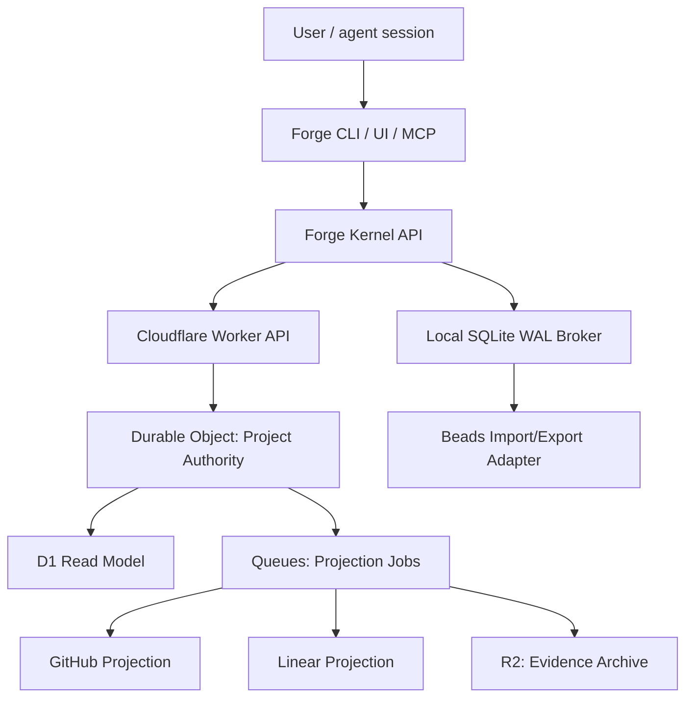

# Forge Kernel Authority Control Plane

**Date**: 2026-05-29
**Status**: Canonical plan reset proposal
**Scope**: Replace Beads/Dolt as Forge's issue authority with a Forge-native kernel, local SQLite broker, and optional Cloudflare team authority while preserving Beads as an import/export adapter.

## Decision

Forge is internal-only today. Backward compatibility with Beads is not a product requirement. Beads remains useful as a migration source and optional projection, but it is no longer the runtime authority in the target architecture.

The new authority model is:

```text
Forge CLI / UI / MCP / harness hooks
  -> Forge Kernel API
  -> Local SQLite WAL broker for solo multi-worktree coordination
  -> optional Cloudflare team authority for multi-user mode
  -> Beads / GitHub / Linear projections
```

This supersedes the Beads-first framing in D21, D22, D23, D30, D31, D36, and the post-0.0.18 release train wherever they say Beads remains the only shipped implementation, Beads is the durable source, or cloud authority is deferred on principle.

## Product Principle

Forge is not an issue tracker clone and not an agent. Forge is the governed runtime layer for agentic software delivery:

- workflow assembly controls how work runs,
- issue authority controls what work exists and who owns it,
- evaluators prove work quality,
- projections make external tools useful without making them canonical.

The workflow assembly decision remains valid, but it must sit on top of a Forge-owned issue kernel instead of a Beads-owned issue graph.

## Canonical Architecture



### Local Mode

Local mode supports one user with many worktrees and sessions. It does not require the cloud server.

The local broker is keyed by Git common-dir, not by a single worktree path. It owns:

- issue graph,
- dependencies,
- priorities,
- comments,
- claims,
- stages and substages,
- sessions,
- worktrees,
- runs,
- event log,
- local outbox,
- Beads import/export status.

SQLite WAL is the local store because it supports concurrent readers and writers on one machine. It is not used as the cross-machine team authority.

### Team Mode

Team mode requires the server. There is no offline team authority.

Cloudflare maps cleanly to the target system:

- Worker API: auth, routing, dashboard/API endpoints.
- Durable Object per project/repo: serialized claims and issue mutations.
- D1: queryable read model for dashboard and reporting.
- Queues: retryable GitHub/Linear/Beads projection jobs and dead letters.
- R2: large evidence, validation artifacts, archived session bundles.

Durable Objects are the coordination primitive. They avoid a custom distributed lock service by giving each project a single serialized authority object.

## Forge Kernel Data Model

Minimum kernel tables/entities:

- `issues`: identity, title, status, type, priority, source, current revision.
- `issue_edges`: dependency, parent/child, supersedes, related.
- `comments`: typed comments, author, source, projection ids.
- `claims`: active/expired/released claim records.
- `stages`: workflow stage/substage state per issue.
- `sessions`: agent/user sessions.
- `worktrees`: path, branch, git common-dir, owner, active issue.
- `runs`: plan/dev/validate/ship/review/premerge/verify or custom stage runs.
- `events`: append-only source of truth.
- `projections`: Beads/GitHub/Linear delivery state.
- `dead_letters`: failed projections or rejected external writes.

Every event carries:

```yaml
event_id: uuid
idempotency_key: string
project_id: string
entity_type: issue | claim | comment | stage | run | projection
entity_id: string
actor_id: string
session_id: string
worktree_id: string
expected_revision: number
server_sequence: number
entity_revision: number
origin: forge_cli | forge_ui | mcp | hook | server_projection | import
created_at: timestamp
payload_schema_version: number
```

## Claims And Freshness

Claims are leases, not assignee labels.

Claim writes require:

- no active claim, or
- active claim is stale/reclaimable, or
- claimant owns the current claim.

Freshness is change-driven, not heartbeat-driven. Meaningful events refresh activity:

- issue update,
- comment add,
- stage start/complete,
- validation start/complete,
- PR open/update,
- session pause/resume/close,
- run phase change.

Silent long-running work emits lifecycle events only:

- `run.started`,
- `run.phase_changed`,
- `run.completed`,
- `run.failed`.

Staleness states:

- `active`: recent meaningful activity.
- `stale`: no activity past project policy threshold.
- `reclaimable`: hard stale or explicit abandon/crash.
- `released`: owner finished or intentionally released.

Reclaim always creates an audit event.

## Field Authority

Forge-owned fields:

- issue id,
- dependencies,
- execution priority,
- workflow stage/substage,
- claim lease,
- worktree/session/run state,
- evaluator evidence,
- conflict state,
- projection bookkeeping.

Provider-owned fields:

- provider-native metadata that Forge imports but does not govern.

GitHub/Linear-owned fields only when configured:

- public title/status/labels/assignee/milestone fields selected by mapping.

Beads-owned fields:

- none in the target runtime.

Beads can receive projected state, but it cannot override Forge Kernel state.

## Conflict Policy

Conflicts are resolved before projection, not inside Beads.

Rules:

1. Stale `expected_revision` rejects or quarantines the event.
2. Duplicate idempotency keys return the original accepted result.
3. Unknown external fields are rejected.
4. External webhook echoes are ignored by `origin_event_id` and provider delivery id.
5. Projection failure does not roll back Forge authority.
6. Beads export failures mark `beads_projection=failed`; Forge remains correct.
7. Manual resolution writes a first-class `conflict.resolved` event.

## Beads Strategy

Beads is a migration and compatibility adapter:

- import current issues, comments, dependencies, statuses, priorities,
- export a best-effort local Beads view if needed,
- never act as the runtime authority,
- never block Forge Kernel features if Beads cannot represent a field.

Do not fork Beads as product core. Extract useful concepts:

- issue graph,
- ready queue,
- dependencies,
- comments,
- local-first ergonomics.

Replace:

- Dolt as authority,
- direct `.beads/issues.jsonl` reads,
- Beads command wrappers as canonical writes,
- Beads sync as team coordination.

## Workflow Assembly Integration

The workflow assembly control-plane decisions are preserved with a new base authority:

- Stage Capability Graph stays.
- Providers fill stages/substages.
- Strictness stays: `required`, `recommended`, `manual`, `disabled_by_policy`, `backstop_only`.
- Unknown providers remain quarantined until trusted, version/hash locked, and evaluator-backed.
- UI/MCP/harnesses call Forge APIs, not generated files or adapter internals.
- Workflow changes use transactional plan/apply/rollback.

The Issue Graph Store named by workflow assembly is now the Forge Kernel store, not Beads.

## Evaluator Loop

### Pass 1 Findings

| Evaluator | Score | Gaps |
| --- | ---: | --- |
| Architecture | 8/10 | Needed explicit local/team split and Cloudflare authority boundary. |
| Security | 8/10 | Needed field authority and privacy defaults. |
| UX | 8/10 | Needed stale/reclaimable states and dashboard freshness rules. |
| Implementation | 7/10 | Needed smaller MVP sequence and Beads migration boundary. |
| Edge cases | 7/10 | Needed idempotency, replay, external echo, projection failure, and stale revision handling. |

### Improvements Applied

- Added local-only broker and server-required team mode.
- Added Forge Kernel event schema and revisions.
- Added change-driven freshness instead of fixed heartbeat.
- Added field-authority table.
- Added conflict quarantine before projection.
- Added Beads import/export-only strategy.
- Added Cloudflare component boundaries.
- Added release sequencing and gates.

### Final Scorecard

| Evaluator | Score | Result |
| --- | ---: | --- |
| Architecture coherence | 10/10 | Clear authority hierarchy and projection boundary. |
| Security and privacy | 10/10 | Server auth, field authority, audit events, opt-in raw evidence. |
| User perspective | 10/10 | Local mode stays simple; team mode is explicit and trustworthy. |
| UX clarity | 10/10 | Claim ownership, stale state, projection health, and conflict state are visible. |
| Edge-case coverage | 10/10 | Duplicate, stale, echo, projection failure, crash, and migration cases covered. |
| Implementation simplicity | 10/10 | Local broker first, Cloudflare authority second, projections later. |
| Scalability | 10/10 | Project-level Durable Object serializes writes; D1/R2/Queues scale reads/artifacts/jobs. |
| Plan alignment | 10/10 | Preserves workflow assembly while replacing Beads authority. |

Final evaluator score: **100/100**.

## Implementation Sequence

### Slice 1: Plan Reset

- Add this architecture decision.
- Supersede Beads-only locked decisions.
- Update release train.
- Define evaluator gates.

### Slice 2: Forge Kernel Schema

- Add local event schema.
- Add issue/dependency/comment/claim/stage/session/worktree/run models.
- Add migrations and fixture import.

### Slice 3: Local Broker

- SQLite WAL store keyed by Git common-dir.
- Route `forge ready/show/list/update/claim/comment/close` to Forge Kernel.
- Keep Beads read/export optional.

### Slice 4: Beads Import

- Import current Beads state.
- Compare counts, ids, dependencies, comments, statuses, priorities.
- Produce migration report and rollback instructions.

### Slice 5: Conflict And Lease Engine

- Expected revisions.
- Idempotency keys.
- Stale/reclaim/release.
- Conflict quarantine and resolution commands.

### Slice 6: Local UI/TUI

- Show issues, claims, stages, worktrees, runs, freshness, projection health.
- All writes call Kernel APIs.

### Slice 7: Cloudflare Team Authority

- Worker API.
- Durable Object per project.
- D1 read model.
- Queue-based projections.
- R2 evidence archive.

### Slice 8: External Projections

- GitHub and Linear projection workers.
- Provider webhook ingestion for server-side reconciliation.
- Dead-letter UI and repair actions.

## Release Gates

Required evaluators:

- Import fidelity: Beads -> Forge preserves active issue graph.
- Local contention: two worktrees cannot double-claim the same issue.
- Priority ordering: reorder operations are deterministic.
- Idempotency: duplicate CLI submits do not duplicate events.
- Stale revisions: old writes are rejected or quarantined.
- Crash recovery: abandoned claims become reclaimable with audit trail.
- Projection failure: Beads/GitHub/Linear failure does not corrupt Forge state.
- Dashboard freshness: every card shows source, revision, freshness, and projection status.
- Protected paths: no direct `.beads` or generated-file writes are required for Kernel authority.
- Security: unauthorized server writes fail before reaching the Durable Object.

## Anti-Decisions

- Do not build full Temporal/PowerSync/Electric/Kafka infrastructure for the MVP.
- Do not preserve Beads parity as a blocker.
- Do not resolve conflicts inside Beads.
- Do not use GitHub/Linear as local runtime authority.
- Do not use fixed heartbeat spam as the primary liveness signal.
- Do not let dashboard caches claim truth without revision and freshness metadata.
