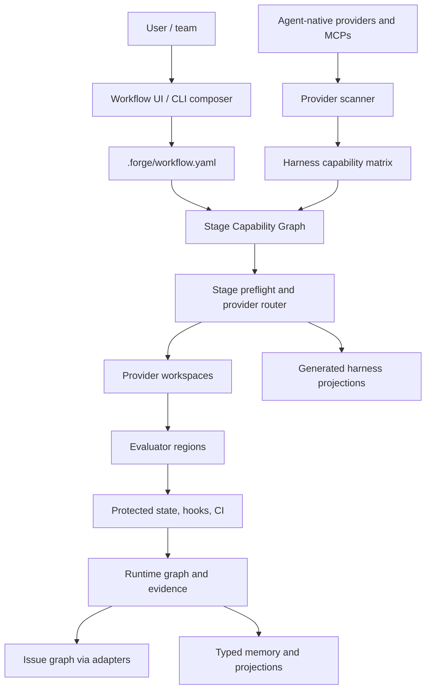

# Workflow Assembly Control Plane

**Date**: 2026-05-28
**Status**: Architecture lock proposal for post-0.0.19 work
**Scope**: Stage and substage configuration, agent-native extension use, provider workspaces, evaluator regions, MCPs, hooks, UI/TUI, and release sequencing.

## Purpose

Forge is not an agent. Forge is installed into agent harnesses and gives a project a governed workflow runtime. Claude, Cursor, Codex, BMAD, Superpowers, Context Mode, Spec Kit, MCP servers, local scripts, and future packs remain external providers. Forge decides how they are selected, projected, gated, evaluated, and recorded for a specific repository.

The product target is:

> Users assemble a project workflow from stages and substages, bind each slot to a provider, choose a simple strictness mode, then Forge verifies availability, routes execution, captures evidence, evaluates outputs, blocks unsafe changes, and records the result in the runtime graph.

This document consolidates the architecture so future implementation PRs do not add isolated features without understanding their effect on the whole runtime.

## Current Foundation

Already landed:

- Canonical docs overhaul and public-release framing.
- Cross-harness skill parity proof.
- Harness capability parity contract.
- Protected path harness manifest.
- Protected state surfaces for Beads, Forge config, generated harness files, extension manifests, lockfiles, workflows, and related state.
- ReviewAdapter and IssueAdapter foundations.
- `forge init` day-one skeleton.
- Team status/runtime surfaces.

Still missing:

- A single workflow configuration model for user-defined stages and substages.
- Provider capability descriptors for agent-native extensions and MCP-backed tools.
- Provider workspaces for external-tool artifacts.
- Evaluator execution against provider outputs.
- Stage preflight enforcement for required provider bindings.
- UI/TUI workflow composer.
- Transactional apply/rollback for workflow changes.

## Evaluator Agent Findings

The plan was evaluated through five critic lenses.

### Architecture Critic

Finding: the previous plan mixed stages, skills, extensions, commands, hooks, and MCP tools without one control model.

Required change: use a Stage Capability Graph. Stages and substages are workflow slots. Providers fill slots. Evaluators prove slot completion. Protected state and issue/memory adapters keep source-of-truth writes controlled.

### Edge-Case Critic

Finding: unknown extensions, changed extension versions, unsupported harness projections, non-required skills, and agent bypasses are the main failure modes.

Required change: do not auto-trust discovery. Unknown providers enter quarantine. Required slots need explicit provider binding, harness support, evidence, and evaluator coverage. Version/hash drift blocks until re-approved.

### Product UX Critic

Finding: a user cannot be expected to know which BMAD or Superpowers skill belongs to which Forge stage.

Required change: Forge must show a workflow assembly view that translates installed provider capabilities into plain stage slots such as `plan.requirements`, `design.architecture`, `dev.tdd`, `review.security`, and `release.npm_pack`.

### Implementation Sequencer

Finding: UI, hooks, extension packs, and team scaling cannot land first. They depend on common contracts.

Required change: implement in this order:

1. Workflow schema and config validator.
2. Provider capability descriptors and scanner.
3. Provider workspace and evidence contracts.
4. Evaluator-region runner for provider outputs.
5. Stage preflight enforcement.
6. CLI workflow composer.
7. Local UI/TUI over the same APIs.
8. Extension-contributed runtime components.
9. Scaled team/orchestrator bridge.

### Market/Adoption Critic

Finding: tools like BMAD, Superpowers, Spec Kit, TaskMaster, Context Mode, and Repomix already solve slices. Forge must not compete by copying them.

Required change: Forge should govern and compose them. It should make external providers project-specific, evidence-backed, and safe rather than trying to replace their native workflows.

### First-Pass Scorecard

| Evaluator | Score | Material gaps found |
| --- | --- | --- |
| Architecture coherence | 9/10 | Needed explicit data files and API boundaries. |
| User experience | 8/10 | Needed concrete first-run, change, and failure flows. |
| Edge cases | 8/10 | Needed lock/version drift, privacy, secret, and team variance details. |
| Implementation readiness | 8/10 | Needed config validation rules and transactional apply semantics. |
| Market fit | 9/10 | Needed clearer statement that external providers are governed by contracts, not copied. |

The rest of this document incorporates those fixes. A later implementation PR should keep a machine-readable acceptance matrix beside the schema tests.

### Second-Pass Scorecard

After patching the first-pass gaps, the plan was re-evaluated against eight rubrics: conceptual completeness, execution clarity, edge-case coverage, UX clarity, implementation sequencing, governance, external ecosystem fit, and team/release alignment.

| Evaluator | Score | Remaining material gaps |
| --- | --- | --- |
| Conceptual completeness | 10/10 | None. |
| Execution clarity | 10/10 | None. |
| Edge-case coverage | 10/10 | None. |
| UX clarity | 10/10 | None. |
| Implementation sequencing | 10/10 | None. |
| Governance | 10/10 | None. |
| External ecosystem fit | 10/10 | None. |
| Team/release alignment | 10/10 | None. |

Adjacent plan docs were also checked for contradictory strictness language. The active plan now uses `required`, `recommended`, `manual`, `disabled_by_policy`, `backstop_only`, and explicit no-silent-fallback wording consistently.

## Final Architecture



## Core Concepts

### Stage

A named phase of work. Forge ships defaults such as `discovery`, `planning`, `design`, `development`, `validation`, `review`, `release`, `verify`, and `learn`, but projects can add, remove, rename, or reorder stages.

Stages are graph nodes, not a hardcoded linear ladder.

### Substage

A capability slot inside a stage. Examples:

- `planning.requirements`
- `planning.task_breakdown`
- `design.architecture`
- `development.tdd`
- `development.debug`
- `validation.docs`
- `review.pr_feedback`
- `release.npm_pack`
- `learn.memory_proposal`

Substages are the unit users bind to providers.

### Provider

Anything that can satisfy a substage:

- Forge core command or skill.
- BMAD agent, task, or generated skill.
- Superpowers skill.
- Spec Kit command flow.
- TaskMaster PRD parser.
- Context Mode MCP/tooling.
- Repomix-like context packer.
- Greptile or another review adapter.
- Local project script.
- Custom MCP server.

Providers are external unless they are explicitly Forge core. Forge governs the boundary around them, not their internal reasoning.

### Capability Descriptor

A normalized record that says what a provider can do.

```yaml
id: bmad.prd
source: .claude/skills/bmad-prd/SKILL.md
native_type: skill
capabilities:
  - planning.requirements
harnesses:
  claude: native
  cursor: translated
  codex: translated
inputs:
  - user_intent
outputs:
  - prd.md
evidence:
  - artifact_exists
  - checklist_passed
permissions:
  writes:
    - provider_workspace
  forbidden:
    - beads_state
    - forge_config
```

### Strictness Mode

Only three modes are allowed:

| Mode | Meaning | Runtime behavior |
| --- | --- | --- |
| `required` | This must run and prove completion. | Block if provider, harness support, evidence, or evaluator is missing. |
| `recommended` | This should run when available. | Warn and record evidence if missing, but do not block. |
| `manual` | User-triggered only. | Do not run automatically. Show as available action. |

No silent fallback is allowed. If users want another provider, they edit the binding.

### Evaluator Region

A validator for a slice of work. Evaluators do not prove that the external provider thought correctly. They prove that the stage contract is satisfied.

Examples:

- PRD completeness evaluator.
- Architecture readiness evaluator.
- TDD red/green/refactor evidence evaluator.
- Protected state evaluator.
- Review packet completeness evaluator.
- Projection consistency evaluator.
- Memory provenance/redaction evaluator.

### Provider Workspace

A structured run directory where external providers place outputs before promotion.

```text
.forge/provider-work/
  bmad/
    planning.requirements/
      run-2026-05-28-001/
        input.json
        output/
        evidence.json
        manifest.json
  superpowers/
    development.tdd/
      run-2026-05-28-002/
        input.json
        evidence.json
        changed-files.json
        logs/
```

Workspace-first providers, such as BMAD or Spec Kit planning, write artifacts into the workspace. Forge validates and promotes approved files into canonical locations such as `docs/work/...`.

Repo-edit providers, such as TDD implementation skills, may edit source and tests only when their stage policy allows it. They still must emit evidence into a provider workspace.

### Harness Projection

Forge does not hand-maintain separate workflows for Claude, Cursor, and Codex. It compiles the active workflow graph into the smallest native surface each harness supports:

- Claude: skills, command shims, hooks where supported, CLAUDE/rules projections.
- Cursor: skills where supported, rules for scoped policy, MCP config where supported.
- Codex: skills, AGENTS instructions, MCP/tool metadata, hooks where supported.

Generated harness files are protected. Users edit workflow config, not generated projections.

## Canonical Files And APIs

Forge needs a small number of canonical files. Everything else is generated, derived, or provider-owned.

| Surface | Role | Write path |
| --- | --- | --- |
| `.forge/workflow.yaml` | Project workflow graph: stages, substages, providers, modes, evaluators. | `forge workflow plan/apply/rollback` or UI over the same API. |
| `.forge/providers.lock` | Approved provider source, version, hash, trust, harness projection status. | Provider resolver/apply transaction only. |
| `.forge/protected-paths.yaml` | Protected state contract. | Forge setup/config API only. |
| `.forge/provider-work/**` | Provider run inputs, outputs, evidence, temporary artifacts. | Stage runtime creates; provider may write inside its run folder. |
| Runtime graph store | Stage events, evidence pointers, issue links, gate decisions. | Forge runtime only. |
| Issue graph store | Issue state through IssueAdapter. | `forge issue *`, UI, MCP, or adapter API only. |
| Generated harness files | Claude/Cursor/Codex projections. | Projection compiler only. |

Required public APIs:

```text
forge workflow discover
forge workflow explain
forge workflow diff
forge workflow plan
forge workflow apply
forge workflow rollback
forge workflow status
forge workflow validate

forge providers scan
forge providers map
forge providers approve
forge providers lock

forge stage preflight <stage-or-substage>
forge stage run <stage-or-substage>

forge evaluator run <region>
forge evaluator report <trace-id>
```

MCP and UI calls must wrap these APIs. They must not create separate write paths.

## User Configuration Model

The workflow config is project-owned and explicit.

```yaml
apiVersion: forge.dev/v1
kind: Workflow
metadata:
  name: production-saas

stages:
  discovery:
    label: Discovery
    after: []
    substages:
      brainstorm:
        provider: superpowers.brainstorming
        mode: recommended
        evaluators:
          - discovery.scope_clarity

  planning:
    label: Planning
    after: [discovery]
    substages:
      requirements:
        provider: bmad.prd
        mode: required
        workspace: workspace_first
        evaluators:
          - planning.prd_completeness
          - planning.scope_control
      task_breakdown:
        provider: spec-kit.tasks
        mode: required
        workspace: workspace_first
        evaluators:
          - planning.tasks_testable

  development:
    label: Development
    after: [planning]
    substages:
      tdd:
        provider: superpowers.tdd
        mode: required
        workspace: repo_edit_with_evidence
        evaluators:
          - development.red_green_refactor
          - development.scope_match
      debug:
        provider: superpowers.systematic_debugging
        mode: recommended

  validation:
    label: Validation
    after: [development]
    substages:
      tests:
        provider: forge.check
        mode: required
      docs:
        provider: forge.docs.verify
        mode: recommended

  release:
    label: Release
    after: [validation]
    substages:
      package:
        provider: forge.npm_pack
        mode: required
      notes:
        provider: forge.release_notes
        mode: required
```

Rules:

- Users can add stages.
- Users can add substages.
- Required substages must have provider, harness support, evidence, and evaluator coverage.
- Recommended substages may lack evaluator coverage, but their result is not a hard gate.
- Manual substages are discoverable actions only.
- Removing a stage removes it from the active graph but keeps historical runtime evidence.
- Renaming a stage requires migration metadata so old run records remain readable.

## Configuration Validation Rules

`forge workflow validate` must reject invalid configurations before they reach any harness.

Hard errors:

- Stage graph has a cycle.
- Stage or substage ID is not stable kebab/snake/dot-compatible ASCII.
- Required substage has no provider.
- Required substage has no evaluator region.
- Required provider is not approved or locked.
- Required provider has no supported projection for the selected harness.
- Provider requests forbidden write surfaces.
- Two providers own the same required substage without explicit composition order.
- `after` references a missing stage.
- Renamed stage lacks `previous_ids`.
- Generated projection drift is detected.

Warnings:

- Recommended provider unavailable.
- Manual provider unavailable.
- Unknown provider detected but not mapped.
- Evaluator exists but has no recent passing evidence.
- Provider is supported through translation rather than native harness support.

Validation outputs must be human-readable and machine-readable so UI, MCPs, and CI can display the same failures.

## User Flows

### First Install

```text
forge init
forge workflow discover
forge workflow configure
forge workflow diff
forge workflow apply
```

The user sees detected harnesses, detected providers, recommended stage bindings, unsupported projections, and conflicts. No generated harness files are written until `apply`.

### Add BMAD For Planning

```text
forge providers scan
forge providers map bmad --capability planning.requirements
forge workflow set planning.requirements.provider=bmad.prd
forge workflow set planning.requirements.mode=required
forge workflow validate
forge workflow apply
```

If BMAD is unavailable in the active harness, the required slot blocks until the user installs/projects BMAD or chooses a different provider.

### Add Superpowers For TDD

```text
forge workflow set development.tdd.provider=superpowers.tdd
forge workflow set development.tdd.mode=required
forge stage preflight development.tdd
```

Forge verifies Superpowers TDD is installed, locked, projectable, and paired with red/green/refactor evidence evaluators.

### Add A Custom Stage

```text
forge workflow add-stage security_review --after validation
forge workflow add-substage security_review.threat_model
forge workflow set security_review.threat_model.provider=acme-threat-model
forge workflow set security_review.threat_model.mode=recommended
```

The custom provider can remain recommended while its evaluator and evidence contract mature. It cannot become required until those contracts exist.

### Failure Recovery

If a required provider is missing:

```text
BLOCKED: development.tdd requires superpowers.tdd.
Reason: provider hash does not match .forge/providers.lock.
Repair:
  forge providers approve superpowers.tdd --new-hash <hash>
  forge workflow apply
```

Forge should always print the failing slot, configured provider, evidence gap, and repair command.

## Provider Discovery And Mapping

Forge cannot map every extension in the world. It maps what the project uses.

Discovery layers:

1. Known provider signatures for common systems such as BMAD, Superpowers, Spec Kit, TaskMaster, Context Mode, and Forge core.
2. Declared provider metadata from local manifests where available.
3. Generic scanner for skill/rule/command/hook/MCP files.
4. User-approved mapping for unknown providers.

Unknown providers are quarantined:

```text
Detected unmapped provider:
  source: .claude/skills/acme-risk-review/SKILL.md
  inferred capability: review.security
  confidence: low

Allowed modes until mapped: recommended, manual
Required mode: blocked until evaluator and evidence contract are defined
```

The user can approve:

```yaml
providers:
  acme-risk-review:
    source: .claude/skills/acme-risk-review/SKILL.md
    approved_by: harsha
    hash: sha256:...
    capabilities:
      - review.security
    allowed_modes:
      - recommended
      - manual
```

## Runtime Flow

Stage execution follows one path:

1. Resolve active workflow graph.
2. Scan harness/provider reality.
3. Compare reality with `.forge/workflow.yaml` and lock metadata.
4. For each required substage:
   - verify provider is installed,
   - verify current harness can project it,
   - verify required MCPs/hooks/commands are available,
   - verify evaluator regions exist,
   - verify protected write policy.
5. Create provider workspace.
6. Project or load required provider instructions.
7. Run the provider through the active harness or Forge/MCP surface.
8. Capture output and evidence.
9. Run evaluator regions.
10. Promote approved outputs or keep failed output quarantined.
11. Record runtime graph event, evidence pointers, issue updates, and memory candidates.
12. Permit or block transition to the next stage.

## Transaction Model

Any operation that changes workflow configuration, provider locks, protected paths, generated harness projections, or UI panel state uses a transaction.

Transaction steps:

1. Read current config, lockfiles, and generated projection hashes.
2. Compute the proposed workflow graph.
3. Run config validation.
4. Run provider/harness preflight.
5. Produce a diff.
6. Ask for explicit apply unless running in a confirmed non-interactive mode.
7. Write new canonical files.
8. Regenerate projections.
9. Run projection consistency evaluator.
10. Write rollback snapshot.
11. Record audit/runtime evidence.

Rollback restores canonical config and regenerated projection state. It does not erase historical runtime evidence.

## Hard Gates For External Providers

Forge cannot hard-gate external provider internals. Forge hard-gates the boundary.

A required provider passes only if:

- the configured provider is available,
- the provider version/hash matches the lock,
- the active harness supports native or translated projection,
- required inputs exist,
- required outputs exist,
- evaluator regions pass,
- protected-state policy is not violated,
- evidence is recorded,
- stage transition is written to the runtime graph.

If any item fails, Forge blocks the stage. No default provider takes over.

## UI/TUI Model

The local UI/TUI is a projection over the same APIs as the CLI.

Panels:

1. Workflow Graph
   - Add stage.
   - Add substage.
   - Reorder stages.
   - Show dependencies.
   - Preview graph.

2. Provider Bindings
   - Pick provider per substage.
   - Show provider source, version, trust, hash, and harness support.
   - Show conflicts.
   - Show missing evaluators.

3. Strictness
   - Required.
   - Recommended.
   - Manual.

4. Evidence And Evaluators
   - Required artifacts.
   - Required logs.
   - Evaluator status.
   - Last run result.

5. Permissions
   - Allowed write surfaces.
   - Blocked surfaces.
   - Protected path repair hints.

6. Harness Projection
   - Claude status.
   - Cursor status.
   - Codex status.
   - Native, translated, unsupported, disabled by policy.

7. Apply Flow
   - Preview diff.
   - Apply transaction.
   - Roll back.

The UI must never write generated harness files, Beads internals, lockfiles, or protected config directly. It must call Forge plan/apply/rollback APIs.

## MCP Role

MCPs are providers or provider support surfaces, not the source of truth.

Examples:

- Context Mode MCP provides context search and batch execution.
- A docs MCP may provide docs search.
- A skills MCP may expose `resolve_required_capabilities`, `load_skill`, and `assert_required_loaded`.
- A remote issue MCP may be an IssueAdapter projection.

MCP-backed substages follow the same rules:

- Required MCP missing: block.
- Recommended MCP missing: warn.
- Manual MCP missing: show unavailable action.
- MCP output must still pass evaluator regions before promotion or stage transition.

## Trust, Security, And Privacy

External providers are not trusted by default.

Trust rules:

- Known provider mappings reduce setup work but do not bypass project approval.
- Unknown providers are quarantined until mapped.
- Required providers must be locked by source and hash or version.
- Remote provider imports must record source, ref, hash, and reviewer.
- Providers can request permissions, but project policy grants them.
- Generated harness files and provider manifests are protected paths.

Security rules:

- Secrets, tokens, env names, absolute local paths, and private URLs must be redacted before evidence becomes memory or release documentation.
- Provider workspace artifacts may contain sensitive raw output and should not be promoted automatically.
- MCP responses are evidence inputs, not source-of-truth writes.
- Required provider failures should reveal enough to repair without leaking secrets.

Privacy rules:

- Local UI/TUI is local-only unless a future release explicitly adds remote mode.
- Provider discovery should inspect configured project and user-level harness locations only.
- Team-visible evidence must distinguish local-only artifacts from shareable artifacts.

## Team Semantics

Team workflows introduce three extra checks:

- Per-user harness support: a required provider may be available for Claude but unavailable for Codex. Assignment should respect that.
- Shared policy, local projection: `.forge/workflow.yaml` is shared; generated harness projection may differ by user/harness.
- Conflict handling: if two team members change workflow policy, Forge must merge at the canonical config layer and regenerate projections rather than merging generated files.

The team board should show:

- active workflow profile,
- required provider health per user/harness,
- blocked assignments caused by missing providers,
- stale projections,
- evaluator failure trends.

## Edge Cases And Required Behavior

| Edge case | Required Forge behavior |
| --- | --- |
| Provider missing | Required blocks; recommended warns; manual action unavailable. |
| Provider version/hash changed | Block required slots until user re-approves. |
| Provider installed in Claude but not Codex | Block in Codex for required slot. |
| Unknown extension detected | Quarantine and ask for mapping. |
| Unknown extension wants required mode | Reject until evidence and evaluator contract exist. |
| Two providers claim same substage | Block config validation until one owner is selected. |
| Provider writes generated harness file | Block through protected-state check unless Forge projection API performed the write. |
| Provider writes Beads state | Block and repair hint to Forge issue API or `bd`. |
| Provider creates messy docs | Keep in workspace until evaluator passes and promotion mapping is approved. |
| User deletes a stage | Validate downstream dependencies and preserve historical run records. |
| User renames a stage | Require migration alias for old runtime records. |
| Evaluator unavailable | Required slot invalid; recommended slot can warn. |
| MCP server down | Same as provider missing based on mode. |
| Agent bypasses Forge | Hooks, protected state, pre-push, and CI catch what the harness missed. |
| Generated projection drift | Regenerate from workflow config or block if hand-edited. |
| Team members use different harnesses | Harness matrix shows per-user projection status before assignment. |
| Extension conflict with Forge-owned flow | Require explicit user resolution; no silent shadowing. |
| Release docs claim feature not landed | Release evaluator blocks docs until evidence distinguishes landed vs planned behavior. |
| Provider output contains secrets | Keep in workspace, redact before promotion, block memory projection until redaction passes. |
| Two users generate different harness files | Treat generated files as projections; regenerate from shared workflow config. |
| Required provider is translated, not native | Allow only if the harness matrix marks translation as supported and evaluator coverage exists. |
| Provider creates issue updates during planning | Route through IssueAdapter or quarantine as proposed changes. |
| Provider workspace grows without cleanup | Keep retention policy tied to runtime evidence and release/debug needs. |
| User wants temporary bypass | Require explicit config change or audited one-time override; never fallback silently. |

## Current Plan Adjustments

The existing release plan remains directionally correct, but the implementation order needs one architecture consolidation before more UI/extension work.

### Required Before 0.0.20 Implementation Broadens

- This architecture document is the shared contract.
- `.forge/workflow.yaml` schema should be designed before UI toggles.
- Provider workspace and evaluator concepts must be included in 0.0.20/0.0.21 planning, even if not fully implemented until 0.0.24.

### Release Mapping

| Release / issue | Role in this architecture |
| --- | --- |
| `0.0.19` protected state | Prevents unsafe direct mutations. Already landed. |
| `0.0.20` issue graph | Gives UI/CLI/MCP one safe issue mutation API. |
| `0.0.21` local UI/TUI | Workflow composer and runtime inspection surface. |
| `0.0.22` hook projection | Projects lifecycle events and catches bypasses per harness. |
| `0.0.23` memory projection | Turns accepted evidence and decisions into controlled memory. |
| `0.0.24` extension runtime components | Lets providers contribute stages, substages, evaluators, UI panels, hooks, adapters, templates, and commands. |
| `0.0.25` scaled team bridge | Adds worker leases, external orchestrator bridge, and large issue-set performance. |
| `forge-besw.6` | Should evolve from extension schema only into provider/capability descriptor schema. |
| `forge-besw.24` | Planning becomes a configurable provider pack, not the universal workflow. |
| `forge-besw.20` | Subagent runs write audit evidence into the runtime graph. |
| `forge-besw.19` | Memory moves to typed, provenance-backed backend APIs. |

## Implementation Backlog

### PR 1: Architecture And Schema Lock

- Add `.forge/workflow.yaml` schema proposal.
- Add `.forge/providers.lock` schema proposal.
- Define stage, substage, provider, evaluator, workspace, projection, and mode fields.
- Define transaction, validation, and rollback semantics.
- Update release plan references.
- Add evaluator-region acceptance matrix.

### PR 2: Workflow Config Validator

- Validate graph shape.
- Validate stage/substage IDs.
- Validate `required`, `recommended`, `manual`.
- Validate provider references.
- Reject required slots without evaluator coverage.
- Reject cycles.
- Emit machine-readable diagnostics for UI, MCP, and CI.

### PR 3: Provider Descriptor Scanner

- Known provider mappings for Forge core, BMAD, Superpowers, Spec Kit, Context Mode.
- Generic scanner for skills/rules/commands/hooks/MCP config.
- Quarantine unknown providers.
- Emit capability descriptor report.

### PR 4: Provider Workspace

- Create run folders.
- Write input, output, evidence, manifest.
- Promotion map for docs/work artifacts.
- Evidence capture for repo-edit providers.

### PR 5: Evaluator Runner

- Run evaluator regions against provider workspace outputs.
- Support pass, fail, known issue, needs human.
- Record trace IDs and evidence pointers.

### PR 6: Stage Preflight Enforcement

- Resolve active graph.
- Assert required providers loaded.
- Assert harness projection support.
- Assert evaluator coverage.
- Block missing or drifted required providers.

### PR 7: Workflow Composer CLI

- `forge workflow discover`.
- `forge workflow configure`.
- `forge workflow explain`.
- `forge workflow status`.
- `forge workflow diff`.
- `forge workflow validate`.
- `forge workflow apply`.
- `forge workflow rollback`.

### PR 8: Local UI/TUI

- Render workflow graph.
- Toggle stages/substages.
- Bind providers.
- Set mode.
- Show evidence/evaluator state.
- Apply via Forge APIs only.

## Non-Negotiable Rules

- No silent fallback.
- Generated harness files are projections, not source of truth.
- Required slots must be enforceable.
- Unknown providers are not required-capable until mapped and evaluated.
- External providers write to workspaces or allowed repo surfaces only.
- UI writes go through plan/apply/rollback APIs.
- Beads, GitHub, MCPs, and agent-native files are adapters/projections, not Forge's canonical workflow source.
- Release docs must distinguish landed behavior from planned behavior.
