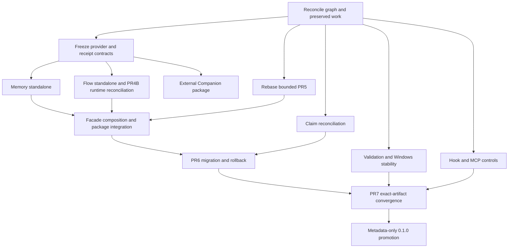

# Forge 0.1.0 scope and parallel delivery plan

## Objective

Release Forge 0.1.0 as a coherent set of independently usable packages with one authority model, one execution receipt model, explicit provider composition, stable migration, and reproducible validation. Preserve completed work and avoid parallel branches that reinterpret the same contracts or edit the same integration files.

## Target architecture

```text
                         forge-workflow
                      compatibility facade
                    /          |          \
                   /           |           \
        @forge/memory      @forge/flow      skills/setup
       authority + facts   execution + canonical receipt
               \              /
                \            /
                 @forge/contracts
           Memory-governed shared library
                         ↑
                  execution providers
                  ├─ local provider
                  └─ agent-companion (external, optional)
```

The user-facing products are Memory, Flow, Agent Companion, and the Forge facade. Contracts is infrastructure. The facade may bundle convenient defaults, but bundling does not change ownership or make one package depend on another package's private implementation.

## 0.1.0 required outcomes

### Contracts and provider seam

- Preserve the existing public contract package and add only the generic provider behavior needed by standalone Flow.
- Freeze packet identity, authority bindings, provider identity, cancellation/cleanup evidence, terminal semantics, stable errors, and compatibility rules.
- Provide shared conformance fixtures. Memory, Flow, and Companion may consume them; they do not fork validators.
- Publish Contracts before Memory and Flow and test consumers first as packed artifacts, then as immutable registry RC artifacts under `next`.

### Standalone Memory (`12d92893`)

- Expose a supported default local assembly through the public package.
- Prove install, store, provenance-backed recall, close/restart, and repeat recall.
- Prove issue/claim/lease authority through the public API.
- Accept one valid receipt idempotently; reject stale, malformed, wrong-capability, conflicting, and incomplete receipts.
- Have no Flow dependency or private Flow import.
- Return stable setup/unavailable errors.

### Standalone Flow (`1ff3d2f9`)

- Expose a supported public assembly with an injected execution provider and public authority boundary.
- Execute a valid WorkPacket and produce the canonical RunReceipt.
- Prove PASS, FAIL, INCOMPLETE, NOT_EXECUTED, timeout, cancellation acknowledgement, terminal cleanup, and no orphan process.
- Have no Memory implementation dependency or authority write path.
- Pass provider conformance with a deterministic local provider. Companion conformance remains an external optional lane.

### Facade and diagnostics (`5f4da13f`, `e8e72233`)

- Rebase and ship the preserved bounded PR5 work rather than restarting it.
- Preserve current binaries, command names, JSON envelopes, exit behavior, and configuration paths.
- Route only through public product surfaces.
- Report missing products and unsupported harness tiers truthfully through `capabilities --json`, preflight, and Doctor.
- Fold the minimum manifest-driven Doctor work into the PR5 owner because it shares capability and health files. Broader health dashboards are later.
- Split full adapter delivery from PR5 acceptance; absent T0-T4 handlers remain explicit `UNAVAILABLE`, not implied support.

### Authority and control reconciliation

- Complete claim projection reconciliation (`9e31a2f0`) before migration.
- Resolve the PR4B parent/child inconsistency. For `6ddd30c6`, `c5112cd4`, `209d80bc`, and `c94f36f9`, either attach current exact-head acceptance evidence and close or implement the missing behavior in the owning lane.
- Complete hook-control (`7268bc9b`) and MCP registry/consent (`9658c21a`) gates without writing Memory/Flow private code.
- Preserve one canonical skill source and prove authorized atomic mirror projection and recovery.

### Migration and packaging (`f2a96ff1`)

- Prove beta.5 inventory, non-mutating dry-run, verified backup, interrupted cutover recovery, rollback, and sole-writer behavior.
- Resolve published runtime completeness (`95372af8`) and global bundled-workspace install behavior (`66e6890a`).
- Keep Beads as inbound migration and temporary rollback compatibility. Do not expose it as live authority.
- Test the facade against independently packed Contracts, Memory, and Flow artifacts rather than workspace links.
- Freeze an exact package/version/contract/source BOM before release convergence.

### Validation and release (`eb2f1753`, `8e634347`)

- Resolve or live-prove stale the open Sonar security rating (`247ec784`).
- Complete process-tree isolation (`50d3f2c3`) and bounded Windows process-heavy scheduling (`fd64f6c9`).
- A child failure, caller timeout, missing shard result, or incomplete aggregate must block release.
- Tag the frozen RC candidate, publish immutable prerelease packages in BOM order under `next`, and run the complete exact-artifact/exact-SHA matrix against what users will install.
- Cover Ubuntu, macOS, Windows, Node 22 and 24, Memory-only, Flow stateless, Flow connected, facade installs, Claude/Codex/Cursor/Hermes projections, and truthful T0-T4 degradation.
- Require at least 50 distinct clean RC journey/environment pairs, every G0-G8 lane, seven cumulative automated observation days, and no unresolved S0/S1 event before metadata-only stable promotion.
- Narrow the remaining skills evaluation blocker (`d362bd71`) to a release acceptance corpus for supported skills. Move the self-improving/continuous optimization loop after 0.1.0.

## Release disposition

### Must complete or close with current evidence

| Area | Issues | Why |
|---|---|---|
| Public products | `12d92893`, `1ff3d2f9` | Advertised packages are not independently usable without these journeys |
| Facade and authority | `5f4da13f`, `9e31a2f0` | Required before migration; avoid hidden fallback and stale claims |
| Migration and release | `f2a96ff1`, `eb2f1753`, `8e634347` | Cutover, rollback, exact artifacts, and promotion |
| Control projections | `7268bc9b`, `9658c21a` | Truthful hook/MCP permissions and capability digests |
| PR4B consistency | `6ddd30c6`, `c5112cd4`, `209d80bc`, `c94f36f9` | Parent is closed while child acceptance remains open |
| Package integrity | `95372af8`, `66e6890a` | Fresh installs must contain and resolve runtime workspace modules |
| Release stability | `247ec784`, `50d3f2c3`, `fd64f6c9` | Security disposition and reproducible cross-platform/runtime validation |
| Supported skill behavior | minimal acceptance slice of `d362bd71` | Stable release should prove the skills it advertises without pulling in a self-improvement platform |

### Conditional, fold into an owner or explicitly defer

| Issue | Disposition |
|---|---|
| `e8e72233` Doctor expansion | Include only package/capability/setup checks required by PR5 and standalone journeys; defer broad health coverage |
| `f21279f4` efficiency supervisor | Keep existing bounded behavior; defer new supervisor expansion until post-release measurements |
| `18307c60` redundant CI executions | Defer unless exact RC evidence exceeds the release ceiling or duplicates a process-heavy shard |
| `6e2ab6d5` auxiliary Bun pins | Include where a release-producing workflow is unpinned; defer unrelated workflows |
| `4dde0085` proof latency/cache study | Post-release benchmark work |

### Parallel external package lane, outside the Forge BOM

Agent Companion issues `85be2945`, `6f2dbe75`, `84c942f3`, `ce785690`, `1fc448fa`, and `8d14651d` remain one independent provider program. The external repository must first produce a clean exact commit, public entrypoint/exports, package-local checks, and bounded progress/cancellation evidence. Forge integration then maps WorkPacket to the Companion request and nests Companion results as provider evidence inside Flow's receipt.

### Later

- Full T0-T4 implementation and certification for every harness.
- Plugin kernel, marketplace, cloud skill sync, broad notification adapters, dashboards, and cross-harness phase hopping.
- Vector memory, Graphiti/OpenViking/Mem0 production integration, and Graphify beyond an optional measured projection.
- Physical repository split.
- Broad policy compilation and model-winner evaluation.
- Cache redesign, impact-aware validation, and speculative startup tuning.
- Beads export/runtime deletion, obsolete binary aliases, generic IssueAdapter deletion, and tracked mirror removal until compatibility windows and consumer scans complete.

### Supersede or remove from active planning

- Legacy PR1/PR2/PR7 identifiers already completed or cancelled in favor of the current restructure records.
- Unparented auto-stubs `590b1ced`, `386b2cce`, `78d19d74`, and `97dd2b3c` after verifying they contain no unique acceptance criterion.
- Stale issue counts and PR labels in planning prose. Keep historical text as history; current work is assigned by acceptance outcome and canonical UUID.

## Conflict-safe delivery train



### R0 — reconciliation and intake

- Re-fetch every canonical issue and exact branch head.
- Close, reopen, split, or supersede inconsistent and duplicate records based on acceptance evidence.
- Preserve all dirty worktrees. Identify which worktree/commit supplies each accepted implementation.
- Rebase PR5 once onto current master and run its focused suite; do not add adapters to that branch.
- The external Companion owner turns its dirty work into a clean reviewable commit/PR in its own repository.

### R1 — minimal contract freeze

One Sol owner controls `packages/contracts/**` and the compatibility baseline. Add the generic provider identity/evidence seam only where standalone Flow tests require it. Publish the frozen commit and schema digest. No other lane edits shared schemas or fixtures.

### R2 — parallel product and stability lanes

| Lane | Exclusive ownership | Must not edit |
|---|---|---|
| Memory | `packages/memory/**`, Memory public assembly and package tests/docs | Flow, facade, root manifests, lockfile, release files |
| Flow | `packages/flow/**`, its provider seam, Flow/monitor runtime and package tests/docs | Memory internals, facade, root manifests, lockfile |
| Companion | External Companion repository/package and its conformance tests | Forge Memory/Flow implementation or Forge authority |
| PR5 | `lib/capabilities/**`, `lib/health/**`, its command/facade files and focused tests | Memory/Flow internals and new adapter implementations |
| Kernel claims | Claim projections and migration preflight only | Package assemblies and capability routing |
| Control projections | Hook and MCP registry/consent adapters and their tests | Memory/Flow internals |
| Validation | Full-suite runner, process/shard scheduling and their tests | Product behavior, package APIs, lockfile |

The same Flow owner handles any real missing PR4B monitor/restart work because it overlaps Flow runtime semantics. A separate worker may audit those issues, but two implementers must not edit Flow/monitor behavior concurrently.

### R3 — serialized integration

After Memory and Flow public APIs are stable, one integration owner updates root `package.json`, `bun.lock`, facade composition, command manifests, generated projections, cross-package fixtures, and package version ranges. This lane absorbs PR5 and packed-install behavior. It is the only lane allowed to regenerate shared files.

### R4 — migration and release

PR6 consumes immutable packed candidates and produces backup/cutover/rollback evidence. PR7 freezes the signed BOM, publishes the exact RC artifacts under `next`, then validates those registry artifacts across the full platform/runtime/product/harness matrix. It also completes security gates, 50 clean journey/environment pairs, and seven cumulative observation days. Stable promotion contains no product behavior changes.

## Stability and performance gates

These budgets are proposed release targets until the candidate produces measured baselines:

| Journey | Gate |
|---|---|
| Cold `forge --version` | p95 at or below 2 seconds on Ubuntu, macOS, and Windows after dependencies are installed |
| Quick setup | p95 at or below 30 seconds, excluding package download |
| Packed package smoke | at or below 60 seconds per package/OS; repeat three times on Windows |
| Memory recall | p95 at or below 2 seconds over 1,000 local records; restart durability 3/3 |
| Flow local receipt | p95 at or below 2 seconds for deterministic provider |
| Cancellation | terminal bounded receipt within 5 seconds; zero orphan child process |
| Full suite | complete inside the existing 25-minute ceiling with `PASS`, zero unexpected skips, and a durable aggregate |

No timeout becomes green by increasing the timeout alone. Speed changes must retain exact-head, security, migration, authority, cancellation, and receipt-completeness coverage. Run focused owner tests per PR and the broad matrix once per unchanged exact release candidate.

## Simplification sequence

### During 0.1.0

- Document one owner for contracts, Memory, Flow, Companion, and facade behavior.
- Convert duplicate root implementations to delegates when touched by the owning product lane.
- Remove no-op or misleading public configuration and documentation.
- Shrink the kernel-only issue backend selector after migration compatibility tests exist.
- Supersede duplicate issue records and correct stale release labels/dependency edges.
- Add package-level entrypoints and stable unavailable diagnostics rather than more routers.

### After 0.1.0

- Delete delegated Memory/Kernel and PR-monitor implementations after call-site and replay proof.
- Retire Beads export/runtime support after the rollback window.
- Remove obsolete binary aliases after an announced compatibility period.
- Remove unnecessary generated/tracked skill mirrors only after clean-install discovery is proven.
- Reassess the abstract IssueAdapter and physical Contracts package from real external consumer data.
- Prune confirmed stale worktrees only after dirty-state and ownership verification.

## Release completion rule

0.1.0 is complete only when every named required outcome has fresh exact-head evidence and the immutable RC artifacts published under `next` reproduce from the signed BOM. The full approved matrix must pass across Ubuntu, macOS, Windows, Node 22/24, Memory-only, Flow stateless, Flow connected, facade installs, and Claude/Codex/Cursor/Hermes projections with truthful capability degradation. Migration and rollback must pass; all G0-G8 receipts must be `PASS`; at least 50 distinct clean RC journey/environment pairs and seven cumulative automated observation days must complete with no unresolved S0/S1 event; the live Kernel release root must be re-fetched with no unresolved blocking dependency. A merged PR, locally packed smoke, green focused test, or old receipt cannot substitute for that proof.
